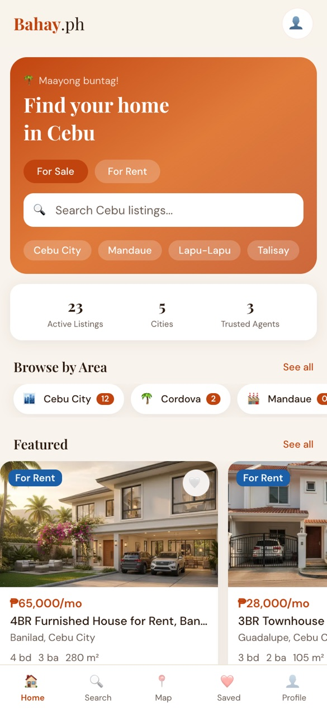
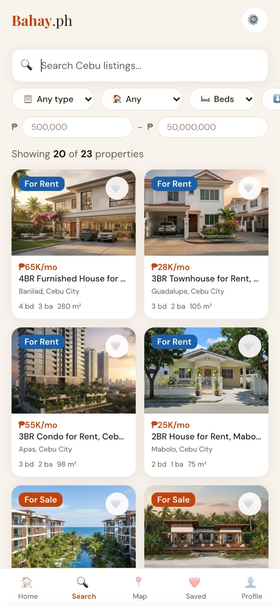
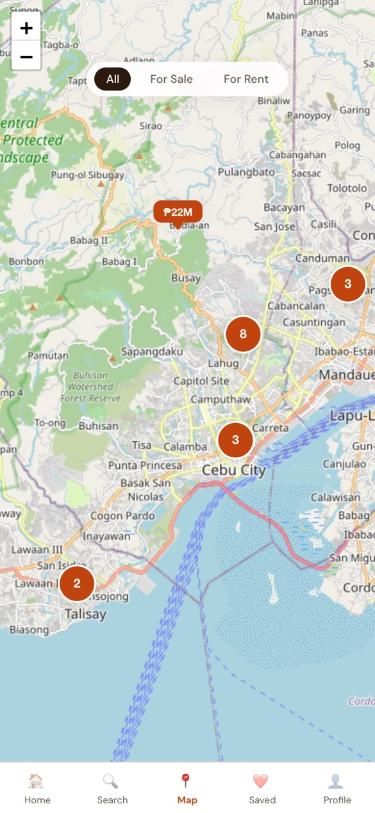
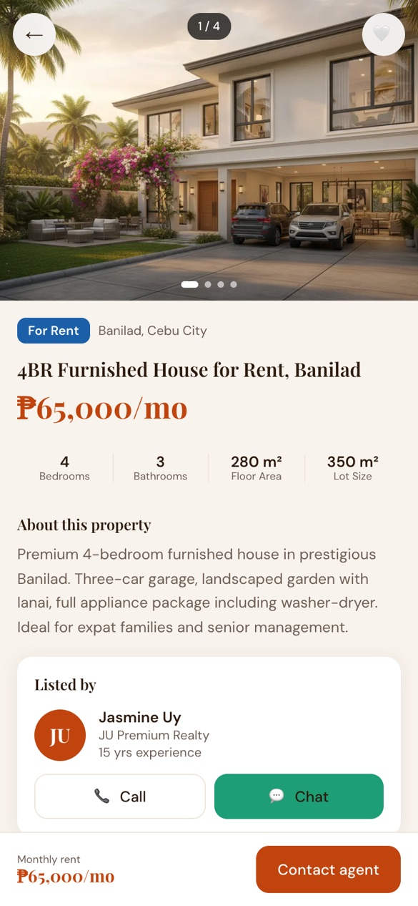
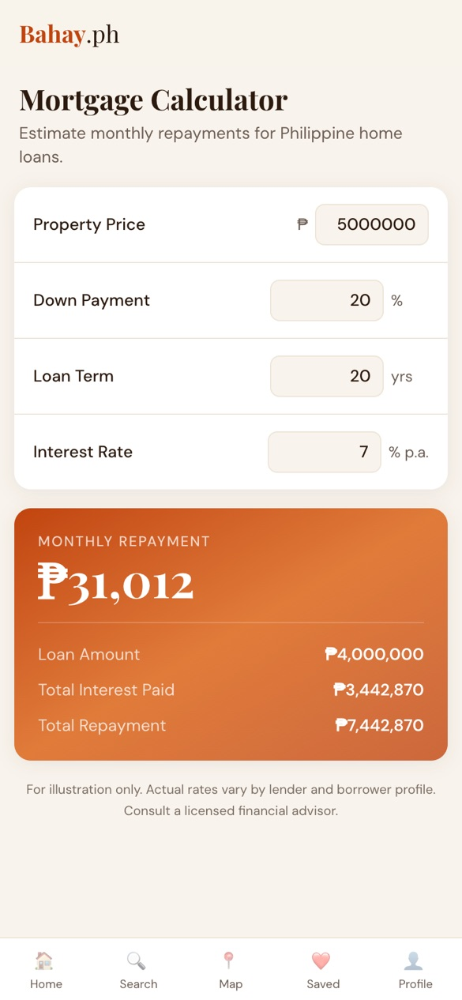
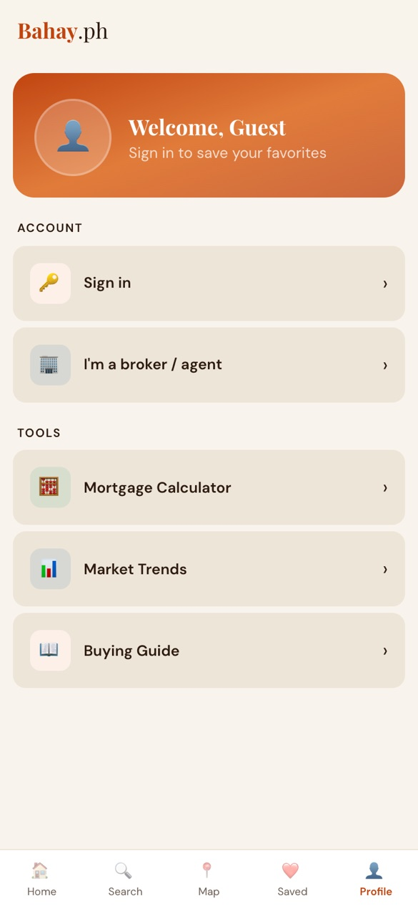
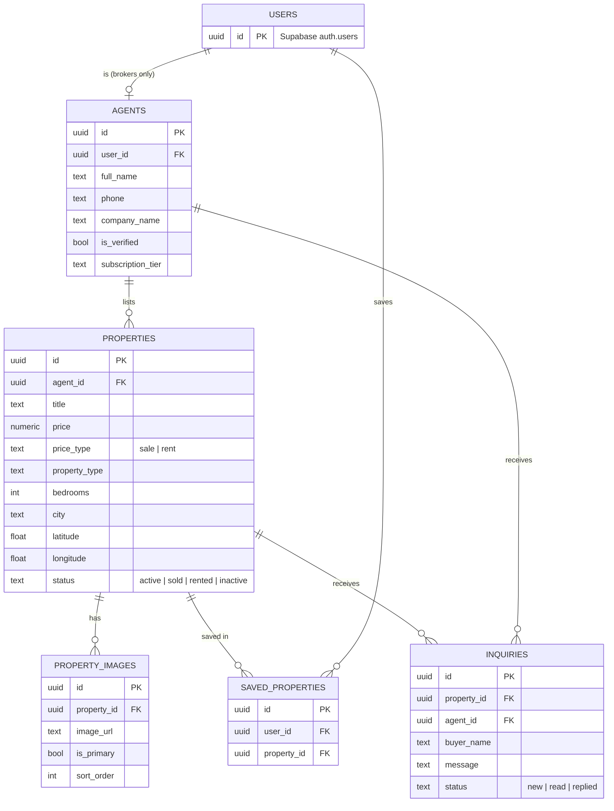

# Bahay.ph

**The trusted, verified property platform for Cebu.**
*Bahay* means "home" in Filipino.

🔗 **Live app:** [baha-ph.vercel.app](https://baha-ph.vercel.app) — best viewed on a phone, or with your browser's mobile view.

<table>
  <tr>
    <td></td>
    <td></td>
    <td></td>
  </tr>
  <tr>
    <td align="center">Home</td>
    <td align="center">Search</td>
    <td align="center">Map</td>
  </tr>
  <tr>
    <td></td>
    <td></td>
    <td></td>
  </tr>
  <tr>
    <td align="center">Property Detail</td>
    <td align="center">Mortgage Calculator</td>
    <td align="center">Profile</td>
  </tr>
</table>

> The listings, agents and photos in the live app are demo data. The property photos were generated with AI for this project.

## Table of Contents
- [UX](#ux)
  - [App Purpose](#app-purpose)
  - [App Goal](#app-goal)
  - [Developer Goals](#developer-goals)
  - [User Goals](#user-goals)
  - [Audience](#audience)
  - [Communication](#communication)
  - [Interaction & Experience Principles](#interaction--experience-principles)
- [Agile Planning](#agile-planning)
  - [Epics & Tickets](#epics--tickets)
  - [Not Implemented](#not-implemented)
  - [MoSCoW Prioritization](#moscow-prioritization)
  - [Workflow](#workflow)
  - [Database Diagram](#database-diagram)
- [Design](#design)
  - [Colour Scheme](#colour-scheme)
  - [Fonts](#fonts)
  - [Shape & Layout](#shape--layout)
- [Features](#features)
  - [Existing Features](#existing-features)
  - [Future Features](#future-features)
- [Testing](#testing)
  - [Manual Testing](#manual-testing)
  - [Bugs](#bugs)
  - [Unfixed Bugs](#unfixed-bugs)
- [Technologies](#technologies)
  - [Main Languages Used](#main-languages-used)
  - [Tech Stack](#tech-stack)
  - [Architecture](#architecture)
  - [Security](#security)
  - [AI-Assisted Development](#ai-assisted-development)
  - [Setup & Installation](#setup--installation)
- [Credits](#credits)

## UX

### App Purpose

Bahay.ph is a real estate listing platform for Metro Cebu in the Philippines — Cebu City, Mandaue, Lapu-Lapu, Mactan, Cordova and Talisay.

In the Philippines, property is often advertised through social media groups and general classifieds, where it is hard to tell a real listing from a fake one. Bahay.ph takes the opposite approach: **only verified, licensed brokers can list properties**, and buyers and renters always browse for free. The inspiration is Sweden's Hemnet — one trusted place to look for a home.

### App Goal

The goal is to make finding a home in Cebu simple and trustworthy. The app should:
- Let anyone browse and search sale and rental listings without an account
- Show listings on a map so buyers can judge the location
- Make it one tap to contact the listing broker on WhatsApp — the most used messaging app in the Philippines
- Let signed-in users save listings to come back to later
- Give verified brokers a dashboard to create, edit and remove their own listings with photos
- Help first-time buyers with a mortgage calculator, market trends and a buying guide

### Developer Goals

To build a production-quality, full-stack web app with a real database, authentication and deployment — not just a front-end prototype.

Specific goals include:
- Use the Next.js App Router with a clear split between Server Components (data fetching) and Client Components (interactivity)
- Use TypeScript in strict mode, with database types generated from the Supabase schema
- Protect all data with Supabase Row Level Security, so rules are enforced by the database and not only by the UI
- Build mobile-first, with a single design token system and no hardcoded colours
- Work in small, reviewable tickets with feature branches, pull requests and a consistent commit convention
- Explore a structured AI-assisted workflow, with written project rules the AI tools must follow

### User Goals

**Buyers and renters** want to:
- Find homes for sale or rent in a specific area of Cebu
- Filter by price, property type and bedrooms
- See where a property is on a map
- Trust that the listing and the broker are real
- Contact the broker quickly, on the app they already use

**Brokers** want to:
- Register and get verified
- Publish listings with photos and an exact map location
- Keep their listings up to date and mark them as sold or rented

### Audience

- **Filipino families and young professionals** looking to buy or rent in Metro Cebu
- **Overseas Filipino Workers (OFWs)** buying property back home from abroad
- **Expats** relocating to Cebu
- **Licensed real estate brokers** who want a trusted place to reach buyers

### Communication

The visual language is warm and local rather than corporate. The primary colour is a terracotta orange, and the names of the colour tokens come from the Philippines — for example *narra*, the national tree, whose dark wood gives the name to the main text colour. The home screen greets users with *"Maayong buntag!"* ("Good morning!" in Cebuano). Headings use an elegant serif font, which gives listings a premium, trustworthy feel.

### Interaction & Experience Principles

- **Browse first, sign up later** — every listing, the map and all tools work without an account
- **One tap to contact** — the main call to action opens a WhatsApp chat with the broker, with the listing name pre-filled
- **Local by default** — prices in Philippine pesos (₱), searches default to Metro Cebu
- **Sale or rent intent is remembered** — choosing "For Rent" on the home screen carries over to Search and the Map
- **Shareable URLs** — search filters are stored in the URL, so a search can be bookmarked or sent to someone
- **Feedback on every action** — skeleton loaders while content loads and toast messages when something is saved or fails

[Back to top](#bahayph)

## Agile Planning

The project was planned as small tickets in [Linear](https://linear.app), numbered `BH-<N>`. Each ticket had acceptance criteria, was built on its own branch (`bahay/BH-<N>-short-description`) and was merged through a pull request with a fixed template. In total, **81 tickets were delivered through 84 merged pull requests**.

The Linear board is private, so the tickets below link to their pull requests on GitHub instead.

### Epics & Tickets

#### EPIC 1 — Setup & Foundations
The project scaffold, design tokens, app shell, shared types and the tooling everything else builds on.

<details>
<summary>Tickets</summary>

- [[BH-01] Project setup and scaffold](https://github.com/PatrikNoordh/bahay-ph/pull/21)
- [[BH-05] Design system tokens](https://github.com/PatrikNoordh/bahay-ph/pull/22)
- [[BH-06] Mock listings data module](https://github.com/PatrikNoordh/bahay-ph/pull/23)
- [[BH-07] Entrance animation utility](https://github.com/PatrikNoordh/bahay-ph/pull/24)
- [[BH-08] App shell and bottom navigation](https://github.com/PatrikNoordh/bahay-ph/pull/25)
- [[BH-09] Topbar component](https://github.com/PatrikNoordh/bahay-ph/pull/26)
- [[BH-20] PWA manifest and install prompt](https://github.com/PatrikNoordh/bahay-ph/pull/37)
- [[BH-37] Environment variable validation at startup](https://github.com/PatrikNoordh/bahay-ph/pull/94)
- [[BH-49] Custom React hooks for data fetching](https://github.com/PatrikNoordh/bahay-ph/pull/112)
- [[BH-50] Auto-generated Supabase TypeScript types](https://github.com/PatrikNoordh/bahay-ph/pull/113)
- [[BH-51] Shared API request and response types](https://github.com/PatrikNoordh/bahay-ph/pull/114)
- [Seed scripts — AI image generation, database seeder, screenshots](https://github.com/PatrikNoordh/bahay-ph/pull/104)
- [[BH-70] Unique per-listing seed images](https://github.com/PatrikNoordh/bahay-ph/pull/128)
- [[BH-93] Release dev to main for production](https://github.com/PatrikNoordh/bahay-ph/pull/176)

</details>

#### EPIC 2 — Browse & Search
The home screen, the property card, the search screen, and connecting them to real Supabase data.

<details>
<summary>Tickets</summary>

- [[BH-10] PropertyCard component](https://github.com/PatrikNoordh/bahay-ph/pull/27)
- [[BH-11] Home screen](https://github.com/PatrikNoordh/bahay-ph/pull/28)
- [[BH-12] Search screen](https://github.com/PatrikNoordh/bahay-ph/pull/29)
- [[BH-22] Replace all mock data with real Supabase queries](https://github.com/PatrikNoordh/bahay-ph/pull/78)
- [[BH-33] Server-side filtering and sorting on Search](https://github.com/PatrikNoordh/bahay-ph/pull/90)
- [[BH-34] Sync filter and tab state to URL params](https://github.com/PatrikNoordh/bahay-ph/pull/91)
- [[BH-35] Skeleton loaders and loading states](https://github.com/PatrikNoordh/bahay-ph/pull/92)
- [[BH-44] Pagination and "Load more"](https://github.com/PatrikNoordh/bahay-ph/pull/102)
- [[BH-62] Connect all pages to live Supabase listings](https://github.com/PatrikNoordh/bahay-ph/pull/106)
- [[BH-67] Rental-aware price range filter](https://github.com/PatrikNoordh/bahay-ph/pull/132)
- [[BH-69] Featured rentals section on the home page](https://github.com/PatrikNoordh/bahay-ph/pull/134)
- [[BH-71] For Sale / For Rent toggle in the hero search](https://github.com/PatrikNoordh/bahay-ph/pull/135)
- [[BH-72] Persist sale/rent intent across Home, Search and Map](https://github.com/PatrikNoordh/bahay-ph/pull/136)
- [[BH-81] Real listing stats and area counts on the home page](https://github.com/PatrikNoordh/bahay-ph/pull/162)
- [[BH-88] Server-filtered props for the home page tabs](https://github.com/PatrikNoordh/bahay-ph/pull/168)

</details>

#### EPIC 3 — Map
An interactive Leaflet map of Metro Cebu with price pins.

<details>
<summary>Tickets</summary>

- [[BH-13] Map screen](https://github.com/PatrikNoordh/bahay-ph/pull/30)
- [[BH-26] Integrate Leaflet.js map](https://github.com/PatrikNoordh/bahay-ph/pull/82)
- [[BH-46] Marker clustering for dense areas](https://github.com/PatrikNoordh/bahay-ph/pull/103)
- [[BH-68] For Sale / For Rent filter on the map](https://github.com/PatrikNoordh/bahay-ph/pull/133)

</details>

#### EPIC 4 — Property Detail & Contact
The listing page, the photo gallery and the WhatsApp and phone calls to action.

<details>
<summary>Tickets</summary>

- [[BH-14] Property detail screen](https://github.com/PatrikNoordh/bahay-ph/pull/31)
- [[BH-24] WhatsApp CTA on the property detail page](https://github.com/PatrikNoordh/bahay-ph/pull/80)
- [[BH-25] Call agent phone CTA](https://github.com/PatrikNoordh/bahay-ph/pull/81)
- [[BH-27] 404 page when a property does not exist](https://github.com/PatrikNoordh/bahay-ph/pull/83)
- [[BH-31] SEO metadata for property pages](https://github.com/PatrikNoordh/bahay-ph/pull/88)
- [[BH-32] Optimised images with next/image](https://github.com/PatrikNoordh/bahay-ph/pull/89)
- [[BH-39] Agent avatar on the property page](https://github.com/PatrikNoordh/bahay-ph/pull/96)
- [[BH-42] Image carousel and gallery](https://github.com/PatrikNoordh/bahay-ph/pull/100)
- [[BH-43] Related properties section](https://github.com/PatrikNoordh/bahay-ph/pull/101)

</details>

#### EPIC 5 — Accounts & Saved Listings
Sign-in, the profile screen, saved listings and user settings.

<details>
<summary>Tickets</summary>

- [[BH-15] Profile screen](https://github.com/PatrikNoordh/bahay-ph/pull/32)
- [[BH-16] Supabase Auth](https://github.com/PatrikNoordh/bahay-ph/pull/33)
- [[BH-19] Saved properties screen](https://github.com/PatrikNoordh/bahay-ph/pull/36)
- [[BH-21] Zustand store for saved properties](https://github.com/PatrikNoordh/bahay-ph/pull/86)
- [[BH-23] Connect the heart button to the API](https://github.com/PatrikNoordh/bahay-ph/pull/79)
- [[BH-36] Toast notifications](https://github.com/PatrikNoordh/bahay-ph/pull/93)
- [[BH-38] Show the signed-in user's name and avatar](https://github.com/PatrikNoordh/bahay-ph/pull/95)
- [[BH-56] Password reset and forgot password flow](https://github.com/PatrikNoordh/bahay-ph/pull/120)
- [[BH-58] Bulk unsave on the saved screen](https://github.com/PatrikNoordh/bahay-ph/pull/121)
- [[BH-83] Email confirmation message after sign-up](https://github.com/PatrikNoordh/bahay-ph/pull/164)
- [[BH-90] Settings sheet — language, about, contact, dark/light mode](https://github.com/PatrikNoordh/bahay-ph/pull/172)

</details>

#### EPIC 6 — Broker Tools
Broker registration, verification and listing management.

<details>
<summary>Tickets</summary>

- [[BH-17] Agent dashboard for listing management](https://github.com/PatrikNoordh/bahay-ph/pull/34)
- [[BH-18] Agent photo upload via Supabase Storage](https://github.com/PatrikNoordh/bahay-ph/pull/116)
- [[BH-29] Property photo upload for agents](https://github.com/PatrikNoordh/bahay-ph/pull/87)
- [[BH-30] Map picker and geocoding in the listing form](https://github.com/PatrikNoordh/bahay-ph/pull/85)
- [[BH-40] Primary image thumbnail in the dashboard](https://github.com/PatrikNoordh/bahay-ph/pull/97)
- [[BH-41] Form validation for creating and editing listings](https://github.com/PatrikNoordh/bahay-ph/pull/98)
- [[BH-48] Broker onboarding flow](https://github.com/PatrikNoordh/bahay-ph/pull/108)

</details>

#### EPIC 7 — Buyer Tools
Extra pages that help buyers make a decision.

<details>
<summary>Tickets</summary>

- [[BH-53] Mortgage calculator](https://github.com/PatrikNoordh/bahay-ph/pull/117)
- [[BH-54] Market trends for Metro Cebu](https://github.com/PatrikNoordh/bahay-ph/pull/118)
- [[BH-55] Buying guide for Philippine property buyers](https://github.com/PatrikNoordh/bahay-ph/pull/119)
- [[BH-66] Rental market metrics on the trends page](https://github.com/PatrikNoordh/bahay-ph/pull/131)

</details>

#### EPIC 8 — Quality, Security & Clean-up
Fixes from a full codebase audit: security issues, design token violations, type safety and dead code.

<details>
<summary>Tickets</summary>

- [[BH-28] Global not-found and error pages](https://github.com/PatrikNoordh/bahay-ph/pull/84)
- [[BH-47] Remove dead profile menu items](https://github.com/PatrikNoordh/bahay-ph/pull/107)
- [[BH-52] Remove unused template assets](https://github.com/PatrikNoordh/bahay-ph/pull/115)
- [[BH-73] Fix SSR hydration mismatch](https://github.com/PatrikNoordh/bahay-ph/pull/138)
- [[BH-74] Fix open redirect vulnerability in auth actions](https://github.com/PatrikNoordh/bahay-ph/pull/155)
- [[BH-75] Remove an unauthenticated internal API endpoint](https://github.com/PatrikNoordh/bahay-ph/pull/156)
- [[BH-76] Fix HTML injection in the broker registration email](https://github.com/PatrikNoordh/bahay-ph/pull/157)
- [[BH-77] Use the shared Supabase client factory in the dashboard](https://github.com/PatrikNoordh/bahay-ph/pull/158)
- [[BH-78] Ownership check in the listing PATCH and DELETE routes](https://github.com/PatrikNoordh/bahay-ph/pull/159)
- [[BH-79] Design token violations in the error page](https://github.com/PatrikNoordh/bahay-ph/pull/160)
- [[BH-80] Inline CSS variables in the map filter pills](https://github.com/PatrikNoordh/bahay-ph/pull/161)
- [[BH-82] Remove a double type cast](https://github.com/PatrikNoordh/bahay-ph/pull/163)
- [[BH-84] Use getUser() instead of getSession()](https://github.com/PatrikNoordh/bahay-ph/pull/165)
- [[BH-85] Delete dead files](https://github.com/PatrikNoordh/bahay-ph/pull/166)
- [[BH-86] Remove an unused hook export](https://github.com/PatrikNoordh/bahay-ph/pull/167)
- [[BH-87] Remove dead developer tooling config](https://github.com/PatrikNoordh/bahay-ph/pull/170)
- [[BH-89] Fix race condition in the saved screen animation](https://github.com/PatrikNoordh/bahay-ph/pull/169)
- [[BH-92] Stabilise accessibility tests](https://github.com/PatrikNoordh/bahay-ph/pull/175)

</details>

### Not Implemented

- [[BH-91] Responsive desktop layout](https://github.com/PatrikNoordh/bahay-ph/pull/173) — started but not merged. The app is designed mobile-first and currently displays as a phone-width column on desktop.

### MoSCoW Prioritization

| Priority | Description |
|----------|-------------|
| **Must Have** | Browse and search listings, property detail, WhatsApp contact, verified-broker listing management, authentication |
| **Should Have** | Map view, saved listings, photo upload, server-side filtering, loading states and error pages |
| **Could Have** | Mortgage calculator, market trends, buying guide, PWA install, dark mode, marker clustering |
| **Won't Have (yet)** | Payments of any kind for buyers, in-app chat, listings from unverified private sellers |

### Workflow

**Backlog → Todo → In Progress → In Review → Done**, tracked in Linear.

Every ticket followed the same flow:
1. Branch from `dev` as `bahay/BH-<N>-short-description`
2. Implement against the ticket's acceptance criteria
3. `npm run lint` and `npm run build` must pass
4. Open a pull request into `dev` using the PR template (summary, what was done per layer, acceptance criteria, manual test steps)
5. Test the change in the app, then merge; `dev` is released to `main`, which Vercel deploys to production

### Database Diagram



The full schema, including all Row Level Security policies, is in [`supabase/bahay_schema.sql`](supabase/bahay_schema.sql).

[Back to top](#bahayph)

## Design

### Colour Scheme

All colours are defined once as Tailwind CSS v4 theme tokens in [`app/globals.css`](app/globals.css). No colour is hardcoded in a component.

| Token | Hex | Used for |
|-------|-----|----------|
| **Terra** (`primary`) | `#C1440E` | Primary buttons, prices, "For Sale" badges, active states |
| **Terra Light** | `#E07B3A` | Warm accent, end of the hero gradient |
| **Terra Pale** | `#FDF0E8` | Hover backgrounds, icon tiles |
| **Ocean** | `#1A5FA8` | "For Rent" badges |
| **Green** | `#1D9E75` | "New" badges, WhatsApp chat button |
| **Sand** | `#F8F3EC` | Page background |
| **Sand Dark** | `#EDE5D8` | Dividers, input borders |
| **Narra** | `#2C1A0E` | Primary text |
| **Muted** | `#6C5D53` | Secondary text |

Dark mode overrides the surface and text tokens (for example Sand → `#1C1410`, Narra → `#F0E8DF`). The muted text colours were darkened (from `#7A6A5E` to `#6C5D53`) during the accessibility work in BH-92 to improve text contrast.

### Fonts

- **[Playfair Display](https://fonts.google.com/specimen/Playfair+Display)** — headings, prices and the logo
- **[DM Sans](https://fonts.google.com/specimen/DM+Sans)** — body text, labels and buttons

Both are loaded through `next/font/google`, so they are self-hosted and don't cause layout shift.

### Shape & Layout

| Element | Value |
|---------|-------|
| Cards | 14px radius, shadow `0 2px 16px rgba(44,26,14,0.08)` |
| Hero | 20px radius |
| Buttons and inputs | 12px radius |
| Pills and chips | Fully rounded |
| Layout | Mobile-first, max 420px wide app container |

[Back to top](#bahayph)

## Features

### Existing Features

**For buyers and renters**
- **Home** — hero search with a For Sale / For Rent toggle, area chips, live listing stats, featured listings and new listings
- **Search** — filter by property type, sale or rent, bedrooms and price range, with sorting, pagination and filters stored in the URL
- **Map** — Leaflet map of Metro Cebu with price pins, marker clustering and a sale/rent filter
- **Property detail** — photo carousel, key facts, description, a mini map, the listing broker and related properties
- **WhatsApp and call buttons** — open a WhatsApp chat with a pre-filled message, or the phone's dialler
- **Saved listings** — heart any listing, then view or bulk-remove saved listings (requires sign-in)
- **Mortgage calculator** — monthly repayment for Philippine home loans
- **Market trends** — median price per square metre by city, for sale and rent
- **Buying guide** — step-by-step guide for buying property in the Philippines
- **Settings** — dark/light mode, language preference, about and contact
- **Installable** — PWA manifest, so the app can be added to the home screen

**For brokers**
- **Broker onboarding** — registration form; the admin gets an email and verifies the broker manually
- **Agent dashboard** — create, edit and delete listings, with form validation
- **Photo upload** — client-side compression, then upload to Supabase Storage
- **Location picker** — place the listing on a map, with address geocoding

**Accounts**
- Email and password sign-up and sign-in with Supabase Auth
- Email confirmation and password reset
- Protected routes (`/saved`, `/agent/dashboard`) enforced by middleware

### Future Features

- **Filipino and Cebuano translations** — the language setting is saved, but the interface is currently English only
- **Responsive desktop layout** ([BH-91](https://github.com/PatrikNoordh/bahay-ph/pull/173))
- **Broker subscriptions** — the `subscription_tier` field (starter, pro, agency) is in the database, but billing is not built
- **Inquiry inbox** for brokers, using the existing `inquiries` table
- **Automated end-to-end tests in CI** — a Playwright suite (E2E, accessibility, security and API tests) is in progress but not yet merged

[Back to top](#bahayph)

## Testing

### Manual Testing

Every feature was tested by hand in the app when it was built. Each pull request lists its manual test steps, and each screen was checked at a 375–390px mobile width.

The table below is a smoke test of the live production site, run on 27 September 2026:

| Feature Area | What was checked | Result |
|:---|:---|:---:|
| **Home** | Hero search, area chips, live listing stats and featured listings load from Supabase | ✅ |
| **Search** | Filter controls and the results grid load with live listings | ✅ |
| **Map** | Price pins and clusters appear across Metro Cebu | ✅ |
| **Property Detail** | Photo carousel, key facts, description and broker card display correctly | ✅ |
| **404 handling** | An unknown property ID returns the 404 page | ✅ |
| **Images** | Listing photos load from Supabase Storage through the Next.js image optimiser | ✅ |
| **Protected routes** | `/saved` and `/agent/dashboard` redirect logged-out visitors to sign-in | ✅ |
| **Tools** | Mortgage calculator, market trends and buying guide display correctly | ✅ |
| **Dark mode** | The saved theme preference is applied on page load | ✅ |

### Bugs

- **Property photos not loading in production (BH-93)** — Production was still running an April build that didn't allow Supabase image URLs in `next.config.ts`. Fixed by releasing `dev` to `main`.
- **Environment variables undefined in the browser (BH-18)** — `NEXT_PUBLIC_` variables were read dynamically, so Next.js couldn't inline them at build time. Fixed by referencing each variable directly.
- **Hydration mismatch in BottomNav, HeroSearch and MapScreen (BH-73)** — Components read `sessionStorage` inside `useState` initialisers, so the server and the browser rendered different HTML. Fixed with `useSyncExternalStore`.
- **Open redirect in sign-in and sign-up (BH-74)** — The `redirectTo` value accepted external URLs. Fixed by allowing only relative paths and falling back to `/profile`.
- **HTML injection in the admin email (BH-76)** — Broker form input was inserted into the email HTML unescaped. Fixed by escaping all user input.
- **Missing ownership check on listing updates (BH-78)** — Fixed by checking in the API route that the listing belongs to the signed-in broker, in addition to RLS.
- **Race condition when removing saved listings (BH-89)** — If the API failed quickly, the item was restored but a scheduled timeout still removed it. Fixed by only removing the item after the API confirms success.

### Unfixed Bugs

- **Dark mode contrast** — Some cards (the stats strip, area chips and listing cards) keep a white background in dark mode while their text turns light, which makes the text hard to read.
- **Placeholder contact number** — The WhatsApp link in the Settings sheet's contact section uses a placeholder number.

[Back to top](#bahayph)

## Technologies

### Main Languages Used
- **TypeScript** (strict mode) — all application code
- **SQL** — database schema, Row Level Security policies and storage policies
- **CSS** — Tailwind CSS v4 with theme tokens

### Tech Stack

| Layer | Technology |
|-------|------------|
| Framework | [Next.js 16](https://nextjs.org) (App Router) with React 19 |
| Language | TypeScript |
| Styling | [Tailwind CSS v4](https://tailwindcss.com) |
| Database | [Supabase](https://supabase.com) (PostgreSQL) with Row Level Security |
| Auth | Supabase Auth via `@supabase/ssr` |
| File storage | Supabase Storage |
| Client state | [Zustand](https://zustand.docs.pmnd.rs) (saved listings) |
| Maps | [Leaflet](https://leafletjs.com) + Leaflet.markercluster, OpenStreetMap tiles |
| Email | [Resend](https://resend.com) |
| Hosting | [Vercel](https://vercel.com) |

### Architecture

```
bahay-ph/
├── app/                      # Routes (Next.js App Router)
│   ├── page.tsx              # Home — Server Component, fetches from Supabase
│   ├── search/  map/  saved/  profile/
│   ├── property/[id]/        # Property detail + generateMetadata
│   ├── agent/                # dashboard/ and onboarding/ for brokers
│   ├── auth/                 # Sign in, callback, password reset
│   ├── calculator/  trends/  guide/
│   └── api/                  # Mutations: listings, images, saved, agents
├── components/               # UI — Client Components where interactive
├── lib/
│   ├── supabase.ts           # Server client
│   ├── supabase-browser.ts   # Browser client
│   ├── database.types.ts     # Generated from the Supabase schema
│   ├── types.ts  api.types.ts
│   └── listingHelpers.ts     # Maps database rows to UI models
├── store/useSavedStore.ts    # Zustand store for saved listings
├── middleware.ts             # Session refresh + protected routes
├── supabase/                 # Schema and storage policy SQL
└── scripts/                  # Image generation and database seeding
```

**Key architectural decisions:**
- **Server Components fetch data** — pages query Supabase on the server and pass plain props down. Client Components never fetch data on first load, which keeps pages fast and avoids loading spinners.
- **API routes handle mutations** — all POST, PATCH and DELETE requests go through `/app/api/*`, which checks the session and ownership before writing.
- **Two Supabase clients** — a server client (cookies, used in Server Components and API routes) and a browser client (used in Client Components). The service role key is never sent to the browser.
- **Generated types** — `npm run gen:types` generates `lib/database.types.ts` from the live schema, so a schema change shows up as a TypeScript error.
- **One source of truth for design** — colours, radii and shadows are theme tokens in `globals.css`, and dark mode swaps the token values.

### Security

- **Row Level Security** is enabled on every table. For example, anyone can read active listings, but only the owning broker can insert, update or delete them.
- **Only verified brokers** (`is_verified = true`) appear publicly.
- **Storage policies** only let a broker upload into folders for properties they own.
- **API routes** check the signed-in user with `getUser()` (validated with Supabase) instead of trusting the session cookie.
- **Secrets** live in environment variables and are never committed.

### AI-Assisted Development

This project was also an experiment in working with AI coding tools in a structured way. Claude Code wrote the code, and I directed the work: tickets with acceptance criteria in Linear, rules in `CLAUDE.md`, and a requirement that lint and build pass. I have not read the code line by line. I tested that every change worked in the app, and redirected the work when it didn't.

- **Written project rules** — [`CLAUDE.md`](CLAUDE.md) defines the architecture, design system, business rules, branch naming, commit format and PR template that AI agents must follow.
- **Tools** — mainly [Claude Code](https://www.anthropic.com/claude-code), plus GitHub Copilot for some tickets.
- **Traceable commits** — every AI-authored commit starts with `[claude]` or `[copilot]` and the model name, for example `[claude] (claude-sonnet-4-6) BH-33 Add Server-Side Filtering and Sorting on Search`.
- **Custom skills** — reusable workflows for creating tickets, implementing a ticket, auditing the codebase and reviewing pull requests. EPIC 8 came out of one of these audits.

### Setup & Installation

**Requirements:** Node.js 20+, a free [Supabase](https://supabase.com) project.

1. Clone the repository:
   ```bash
   git clone https://github.com/PatrikNoordh/bahay-ph.git
   cd bahay-ph
   npm install
   ```
2. Copy `env.local.example` to `.env.local` and add your Supabase URL, anon key and service role key. `RESEND_API_KEY` (email) and `GEMINI_API_KEY` (seed image generation) are optional.
3. In the Supabase SQL editor, run [`supabase/bahay_schema.sql`](supabase/bahay_schema.sql), then everything in [`supabase/migrations/`](supabase/migrations/).
4. In Supabase Storage, create a **public** bucket named `property-images`.
5. Optional — seed demo data:
   ```bash
   node scripts/generate-images.mjs   # AI-generated property photos (needs GEMINI_API_KEY)
   node scripts/seed-database.mjs     # 3 agents and 20+ listings
   ```
6. Start the dev server:
   ```bash
   npm run dev
   ```
   Open [http://localhost:3000](http://localhost:3000).

| Command | Description |
|---------|-------------|
| `npm run dev` | Start the development server |
| `npm run build` | Production build |
| `npm run lint` | Run ESLint |
| `npm run gen:types` | Regenerate Supabase TypeScript types (run `npx supabase login` once first) |

[Back to top](#bahayph)

## Credits

### Content

Product, planning and testing by [Patrik Noordh](https://github.com/PatrikNoordh). Code written with [Claude Code](https://www.anthropic.com/claude-code) and GitHub Copilot — see [AI-Assisted Development](#ai-assisted-development).

### Media

- **Property photos** — generated with Google's Gemini image model (`gemini-2.5-flash-image`) using [`scripts/generate-images.mjs`](scripts/generate-images.mjs)
- **Map data** — © [OpenStreetMap](https://www.openstreetmap.org/copyright) contributors
- **Fonts** — [Google Fonts](https://fonts.google.com)
- **Icons** — native emoji

### Inspiration

- [Hemnet](https://www.hemnet.se) — Sweden's property portal, the model for a single trusted place to find a home
- [PawPals](https://github.com/Linnea87/pawpals) — the README structure is based on an earlier team project I worked on
